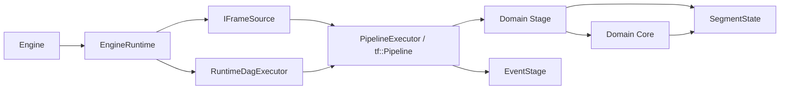
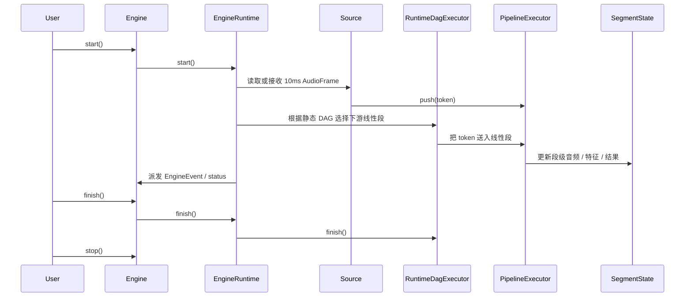

# 架构设计

## 核心结构

当前默认阅读口径请放在单线流式 ASR 主线；静态 DAG 是同一运行时体系下的扩展能力。

## 关键关系

- `Engine` 是对外 API。
- `EngineRuntime` 是内部编排器。
- `RuntimeDagExecutor` 管静态 DAG 的 branch/join 语义。
- `PipelineExecutor` 管线性 stage 路径。
- 领域 `Stage` 管 runtime 语义和 token/segment 流转。
- `Core` 负责真实算法处理。
- `EventStage` 负责运行时事件分发。
- `SegmentState` 是新主线的数据面。

## 默认主线路径

## 设计要点

1. 输入源在 pipeline 之外。
2. 最小流转单位是 `PipelineToken`，而不是共享 `Context` 里的临时键值。
3. 线性段执行模型是“外层 source/event 线程 + `tf::Pipeline`”。
4. 静态 DAG 的 branch/join 由 `RuntimeDagExecutor` 负责。
5. `Vad / Feature / Asr` 领域 stage 现在已经与对应 core 按领域靠拢组织。
6. stage 间的 `input/output.key` 目前更多是配置元数据，不是完整的数据总线。

## 模式语义

- `mode=offline` 会把文件 source 的实际 `playback_rate` 强制改成 `0.0`
- `source.type=file` 使用 `FileSource + AudioFramePipelineSource`
- `source.type=microphone` 和 `source.type=stream` 目前都会回退到默认 `MicSource`

详细设计说明见 [design.md](/Users/eagle/workspace/Playground/Yspeech/doc/design.md)。
