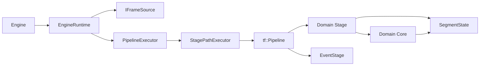
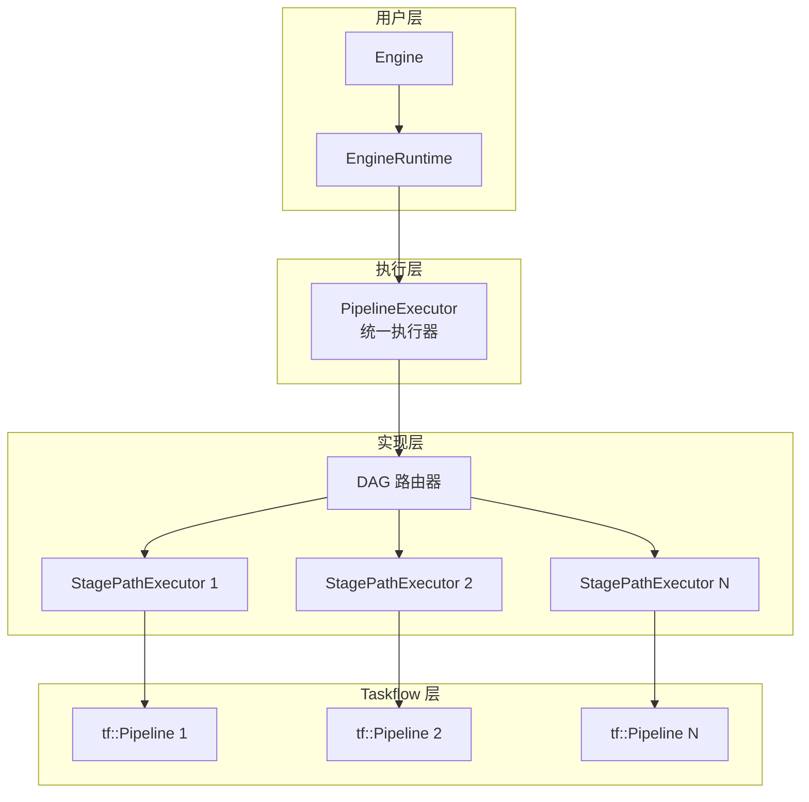
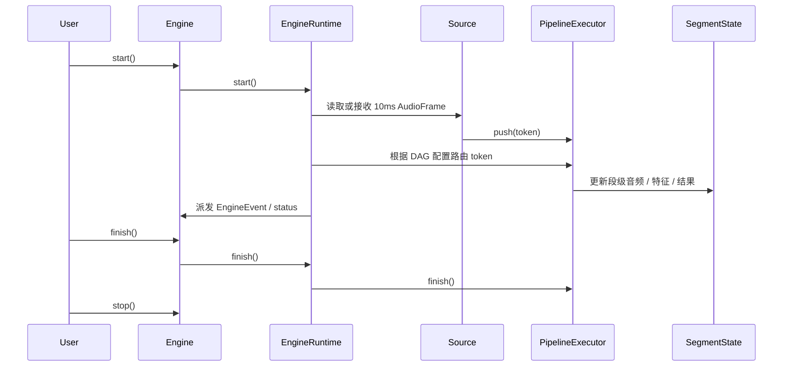

# 架构设计

## 核心结构

当前默认阅读口径请放在单线流式 ASR 主线；静态 DAG 是同一运行时体系下的扩展能力。

## 关键关系

- `Engine` 是对外 API。
- `EngineRuntime` 是内部编排器。
- `PipelineExecutor` 是统一执行器，支持线性路径和 DAG 路由。
- `StagePathExecutor` 是内部实现，负责单条线性路径的执行。
- `tf::Pipeline` 是底层的 Taskflow Pipeline 实现。
- 领域 `Stage` 管 runtime 语义和 token/segment 流转。
- `Core` 负责真实算法处理。
- `EventStage` 负责运行时事件分发。
- `SegmentState` 是新主线的数据面。

## 统一执行器架构

### 设计理念

**线性流水线 = 单路径 DAG（特例）**

`PipelineExecutor` 统一处理两种场景：
- **线性路径**：配置为单路径 DAG，内部创建 1 个 `StagePathExecutor`
- **复杂 DAG**：配置为多路径 DAG，内部创建 N 个 `StagePathExecutor` + Branch/Join 路由

### 架构层次

### 核心优势

1. **简化 API**：用户只需与 `PipelineExecutor` 交互，无需判断使用哪个执行器
2. **统一语义**：线性路径和 DAG 路由使用相同的接口
3. **灵活扩展**：支持从简单线性到复杂 DAG 的平滑演进
4. **性能优化**：线性路径无额外开销，DAG 路由按需创建

## 默认主线路径

## 设计要点

1. 底层输入源实现仍在 pipeline 之外，但运行时会把它编译成显式的 `SourceStage`。
2. 最小流转单位是 `PipelineToken`，共享运行状态通过 `RuntimeContext` 传递。
3. 线性段执行模型是"外层 source/event 线程 + `tf::Pipeline`"。
4. 静态 DAG 的 branch/join 由 `PipelineExecutor` 内部的路由器负责。
5. `Vad / Feature / Asr` 领域 stage 现在已经与对应 core 按领域靠拢组织。
6. stage 间的 `input/output.key` 目前更多是配置元数据，不是完整的数据总线。

## 模式语义

- `mode=offline` 会把文件 source 的实际 `playback_rate` 强制改成 `0.0`
- `source_stage.ops[0].name = FileSource` 使用 `FileSource + AudioFramePipelineSource`
- `source_stage.ops[0].name = MicrophoneSource` 使用 `MicSource`
- `source_stage.ops[0].name = StreamSource` 使用独立的 `StreamSource`

## 组件职责

### PipelineExecutor（统一执行器）

**职责：**
- 解析 DAG 配置，拆分为多个线性路径
- 管理 `StagePathExecutor` 的生命周期
- 实现 Branch/Join 路由逻辑
- 处理 token 的分发和汇聚

**关键方法：**
- `configure()`：配置 DAG 结构
- `push()`：推送 token 到入口路径
- `finish()`：标记处理完成
- `stop()`：停止所有路径

### StagePathExecutor（内部实现）

**职责：**
- 执行单条线性 stage 路径
- 封装 `tf::Pipeline` 的调用
- 管理 token 队列和背压
- 触发 stage callback

**特点：**
- 不直接对外暴露
- 每个 DAG 路径一个实例
- 完全独立的执行上下文

详细设计说明见 [design.md](/Users/eagle/workspace/Playground/Yspeech/doc/design.md)。
