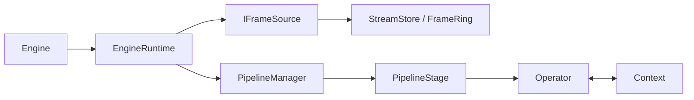
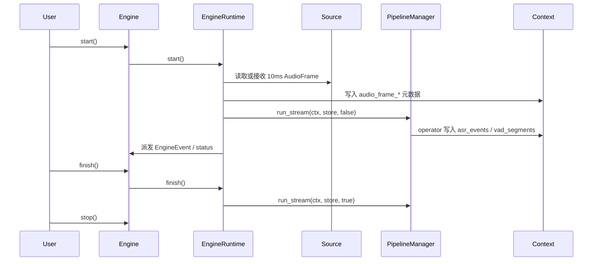

# 架构设计

## 核心结构

## 关键关系

- `Engine` 是对外 API。
- `EngineRuntime` 是内部编排器。
- `PipelineManager` 管 stage。
- `PipelineStage` 管 operator DAG。
- `StreamStore` 负责 `AudioFrame` 流通。
- `Context` 负责中间结果、事件、错误和统计。

## 真实执行路径

## 设计要点

1. 输入源在 pipeline 之外。
2. 最小数据单位是 `shared_ptr<const AudioFrame>`。
3. 执行模型是“外层 source/event 线程 + stage 内 Taskflow”。
4. 流式入口是 `run_stream(ctx, store, flush)`。
5. stage 间的 `input/output.key` 目前更多是配置元数据，不是完整的数据总线。

## 模式语义

- `mode=offline` 会把文件 source 的实际 `playback_rate` 强制改成 `0.0`
- `source.type=file` 使用 `FileSource + AudioFramePipelineSource`
- `source.type=microphone` 和 `source.type=stream` 目前都会回退到默认 `MicSource`

详细设计说明见 [design.md](/Users/eagle/workspace/Playground/Yspeech/doc/design.md)。
