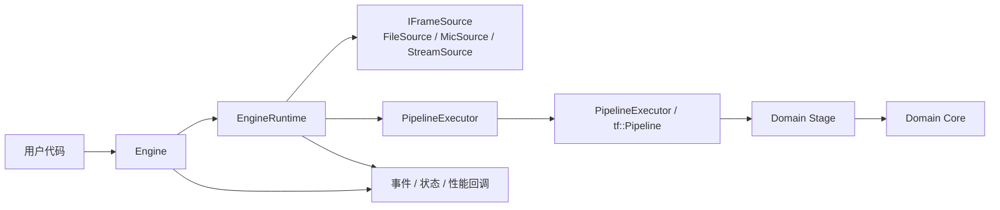
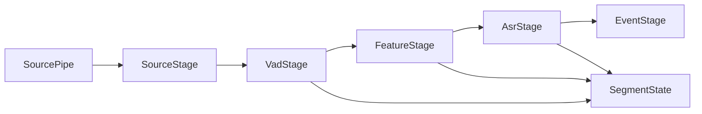
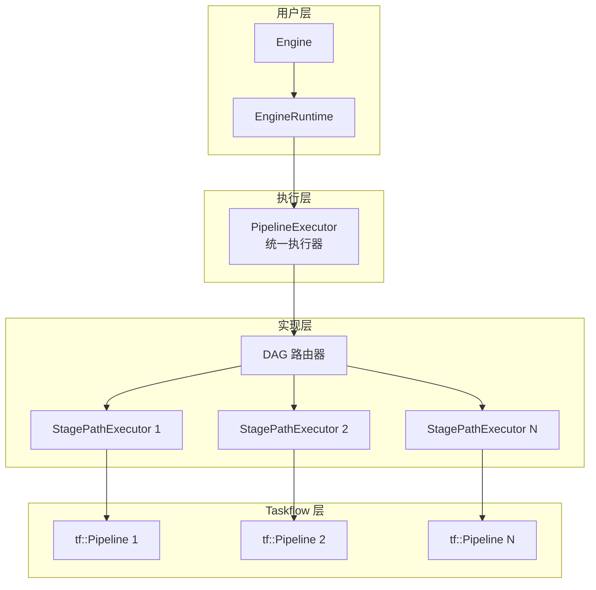
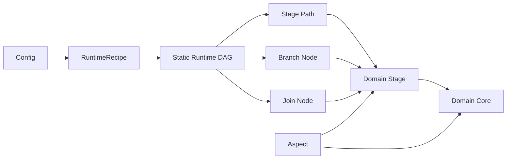
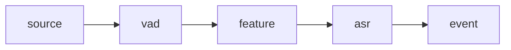
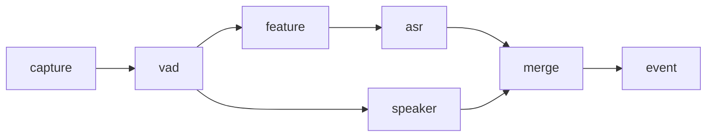

# 设计文档

本文档基于当前代码实现整理，重点回答三个问题：

- 系统是怎样跑起来的
- 核心组件各自负责什么
- 配置里哪些字段真的驱动了运行时，哪些只是被解析或保留

## 总览

当前流式运行时已经统一到 Taskflow 主线；静态 DAG 能力作为同一套设计下的扩展层存在，但不反客为主。



## 当前主线运行时

当前默认主线是 Taskflow 运行时路径，它使用真正的 `tf::Pipeline` 来承载线性流段。

其核心结构如下：



这条路径已经是当前流式运行时默认主线；线性配置会先被编译成单路径静态 DAG，再交给 `PipelineExecutor` 统一执行。

这里需要区分两层：

- `SourcePipe`
  - `tf::Pipeline` 的技术入口，负责 token 注入和背压
- `SourceStage`
  - 显式的运行时节点，负责把 source 也纳入 stage DAG 语义

## 统一执行器设计

当前运行时采用统一的 `PipelineExecutor` 架构，核心设计理念是：

**线性流水线 = 单路径 DAG（特例）**

### 架构层次



### 核心优势

1. **简化 API**：用户只需与 `PipelineExecutor` 交互，无需判断使用哪个执行器
2. **统一语义**：线性路径和 DAG 路由使用相同的接口
3. **灵活扩展**：支持从简单线性到复杂 DAG 的平滑演进
4. **性能优化**：线性路径无额外开销，DAG 路由按需创建

### 组件职责

**PipelineExecutor（统一执行器）**
- 解析 DAG 配置，拆分为多个线性路径
- 管理 `StagePathExecutor` 的生命周期
- 实现 Branch/Join 路由逻辑
- 处理 token 的分发和汇聚

**StagePathExecutor（内部实现）**
- 执行单条线性 stage 路径
- 封装 `tf::Pipeline` 的调用
- 管理 token 队列和背压
- 触发 stage callback

**使用示例：**

```cpp
yspeech::PipelineExecutor executor;
executor.configure(builder_config, *pipeline_runtime_context_, *segment_registry_);
executor.set_stage_callback(PipelineStageRole::Source, source_callback);
executor.set_stage_callback(PipelineStageRole::Vad, vad_callback);
executor.start();
executor.push(token);
executor.finish();
executor.wait();
```

## 静态 DAG 设计理念

**核心洞察：线性流水线 = 单路径 DAG（特例）**

之前的架构存在两个独立的执行器：
- `PipelineExecutor`：负责线性路径
- `RuntimeDagExecutor`：负责 DAG 路由

这导致调用方需要判断使用哪个执行器，增加了复杂度。

**新架构：统一执行器**

将 `RuntimeDagExecutor` 的功能整合到 `PipelineExecutor` 中：
- **线性路径**：配置为单路径 DAG，内部创建 1 个 `StagePathExecutor`
- **复杂 DAG**：配置为多路径 DAG，内部创建 N 个 `StagePathExecutor` + Branch/Join 路由

### 架构层次


### 组件职责

**PipelineExecutor（统一执行器）**
- 解析 DAG 配置，拆分为多个线性路径
- 管理 `StagePathExecutor` 的生命周期
- 实现 Branch/Join 路由逻辑
- 处理 token 的分发和汇聚

**StagePathExecutor（内部实现）**
- 执行单条线性 stage 路径
- 封装 `tf::Pipeline` 的调用
- 管理 token 队列和背压
- 触发 stage callback

### 核心优势

1. **简化 API**：用户只需与 `PipelineExecutor` 交互，无需判断使用哪个执行器
2. **统一语义**：线性路径和 DAG 路由使用相同的接口
3. **灵活扩展**：支持从简单线性到复杂 DAG 的平滑演进
4. **性能优化**：线性路径无额外开销，DAG 路由按需创建

### 代码对比

**重构前（需要二选一）：**
```cpp
const bool uses_runtime_dag = std::ranges::any_of(builder_config.recipe.stages, [](const auto& stage) {
    return !stage.depends_on.empty() || !stage.downstream_ids.empty();
});

if (uses_runtime_dag) {
    runtime_dag_executor_ = std::make_unique<RuntimeDagExecutor>();
    runtime_dag_executor_->configure(builder_config, *runtime_, *registry_);
} else {
    pipeline_executor_ = std::make_unique<PipelineExecutor>();
    pipeline_executor_->configure(builder_config, *runtime_, *registry_);
}
```

**重构后（统一接口）：**
```cpp
pipeline_executor_ = std::make_unique<PipelineExecutor>();
pipeline_executor_->configure(builder_config, *pipeline_runtime_context_, *segment_registry_);
```

## 静态 DAG 设计

新运行时的正式设计口径不是“整个系统只有一条线性 pipeline”，而是：

- 配置描述 stage DAG
- 启动期根据配置构建静态运行图
- 运行期 DAG 结构不再变化
- 线性子路径优先由 `tf::Pipeline` 承载
- branch / join 由 runtime DAG 层处理



### 当前推荐原则

1. 配置控制 DAG 结构，运行时结构固定不变。
2. `tf::Pipeline` 负责线性流段，而不是强行承载任意 DAG。
3. `Source` 也是显式 stage；顶层 `source` 只是简写，运行时会编译成 `SourceStage`。
4. 领域 `Stage` 负责 runtime 语义和 token/segment 流转。
5. `Core` 负责真实算法处理。
6. `EventStage` 负责事件分发，属于 runtime 骨架层，而不是算法领域层。
7. `Aspect` 继续保留，用于日志、计时、统计、告警、追踪等横切能力。

## 通用 Profiling 设计

当前 `TimerAspect` 已经能稳定给出 `Stage -> Core` 边界级别的总耗时，但当某个 core 成为主热点时，我们还需要继续回答：

- 时间是花在 `pack`、`run` 还是 `decode`
- 不同 core 是否都能按统一方式暴露内部阶段时间
- 这些 profiling 数据由谁生产、由谁消费、最终显示到哪里

### 设计目标

1. 保留 `TimerAspect` 作为默认性能主统计链。
2. 新增一套通用 profiling 能力，用于 core 内部阶段拆分。
3. 这套能力既要支持 `streaming_demo` 观察，也要支持后续导出、状态和告警消费。
4. profiling 方案不能把 `Capability` 误用成唯一采样入口。

### 边界划分

Profiling 统一按三层职责拆开：

- `Aspect`
  - 负责 `Stage -> Core` 边界总耗时
  - 定义默认 `ProcessingStats` 口径
- `Core internal profiling`
  - 负责 core 内部阶段时间采集
  - 例如 `pack / run / decode`
- `Capability`
  - 负责消费 profiling 数据
  - 例如打印、导出、状态上报、告警

一句话原则：

- `Aspect` 负责“这个 core 总共花了多久”
- `Core profiling` 负责“这段时间具体花在哪里”
- `Capability` 负责“这些数据要不要额外输出或治理”

### 数据模型

建议在运行时引入统一的 phase profiling 结构，而不是让每个 core 私下维护一套不兼容字段。

推荐最小模型：

```cpp
struct CorePhaseTiming {
    std::string core_id;
    std::string phase;
    double total_time_ms = 0.0;
    std::size_t calls = 0;
    std::vector<double> samples_ms;
};
```

对应地，`RuntimeContext` / `ProcessingStats` 增加统一容器：

- `core_phase_timings`

phase 名称由 core 自己声明，但建议先约定这几个标准名：

- `pack`
- `run`
- `decode`
- `postprocess`

如果某个 core 没有这么多阶段，也可以只产出它实际拥有的 phase。

### 生产方式

通用 profiling 不通过 capability 直接测量，而是由 core 主动记录。

推荐方式：

1. core 内部通过统一 helper/RAII scope 记录阶段时间
2. 最终把数据写进 `RuntimeContext.stats`

例如在 `ParaformerCore::infer(...)` 内部：

- `pack_partial` / `pack_final`
  - `FeatureSequenceView -> input_buffer`
- `run_partial` / `run_final`
  - `session->Run(...)`
- `decode_partial` / `decode_final`
  - logits -> token -> text

这样做的原因是：

- 只有 core 自己知道内部阶段边界
- `Capability` 只能包住 core 调用前后，看不到 core 内部细节

### 消费方式

这套 profiling 数据的第一消费者应该是：

- `streaming_demo`

建议新增一个单独表：

- `Core Phase Performance`

示意：

| Core | Phase | Total | Avg | Calls | P50 | P95 | % Core |
|------|------|------|------|------|------|------|------|
| asr | run_partial | ... | ... | ... | ... | ... | ... |
| asr | run_final | ... | ... | ... | ... | ... | ... |
| asr | decode_partial | ... | ... | ... | ... | ... | ... |
| asr | decode_final | ... | ... | ... | ... | ... | ... |

同时保留现有：

- `Performance Summary`
- `Core Performance`

也就是说：

- `Core Performance`
  - 看哪个 core 是热点
- `Core Phase Performance`
  - 看这个热点内部哪一段最重

当前主线里，这张表已经能稳定回答：

- `asr/run` 是主热点
- `run_final` 通常比 `run_partial` 更贵
- `pack/decode` 目前不是主瓶颈

### Capability 在 Profiling 中的位置

Capability 可以参与 profiling，但只能作为“消费者增强层”，不能取代主采样链。

适合的 capability 形态：

- `ProfilingCapability`

它的职责不是测时间，而是读取已有 `core_phase_timings` 数据并执行：

- 打日志
- 发状态
- 导出
- 触发阈值告警

因此，profiling 设计里：

- 不让 `Capability` 直接承担默认性能采样
- 但允许它基于已采样的数据做治理动作

### 实施顺序

推荐按低风险顺序落地：

1. `RuntimeContext` / `ProcessingStats` 增加统一 `core_phase_timings`
2. `ParaformerCore` 先接 `pack/run/decode`
3. `streaming_demo` 增加 `Core Phase Performance`
4. 再逐步给 `SenseVoiceCore / WhisperCore / KaldiFbankCore` 接入
5. 最后如有需要，再补 `ProfilingCapability`

### 当前认知结论

- 默认性能统计主链仍然是 `TimerAspect`
- core 内部阶段 profiling 是新增的第二层观测能力
- `Capability` 只负责消费 profiling 数据，不负责定义默认统计口径

### 线性段与分支能力

当前推荐主线是单路径静态 DAG：



但设计上已经明确要扩展到可配置依赖关系，例如：



这类结构在新设计里会被解释为：

- `vad -> feature -> asr` 是一个线性段
- `vad -> speaker` 是一条分支
- `merge` 是汇聚点

## Recipe 与运行图

`PipelineRuntimeRecipe` 现在不仅表达角色识别，也开始表达 DAG 信息：

- `stage_id`
- `role`
- `depends_on`
- `downstream_ids`
- `node_kind`
- `join_policy`

其中 `node_kind` 约定为：

- `Linear`
- `Branch`
- `Join`
- `Isolated`

其中 `join_policy` 当前约定为：

- `all_of`
- `any_of`

语义如下：

- `all_of`
  `Join` 节点等待所有上游都为同一 token key 产出结果后，再向下游继续推进。
- `any_of`
  `Join` 节点在任一上游结果到达时即可向下游继续推进，后续同 key 结果默认不重复触发，`eos` 例外。

示例：

```json
{
  "id": "merge_stage",
  "depends_on": ["feature_stage", "vad_stage"],
  "join_policy": "all_of",
  "ops": [
    { "id": "merge", "name": "JoinBarrier" }
  ]
}
```

这使得运行时可以在不破坏配置驱动思路的前提下，把配置编译成静态 DAG，并把分支汇聚语义也纳入配置模型。

## 设计结论

1. `Engine` 是用户入口。
   它负责把 `EngineRuntime` 暴露成更稳定的 API，并把 ASR/VAD/状态/告警统一包装成 `EngineEvent`。

2. `EngineRuntime` 是真正的编排层。
   它负责读取运行时配置、创建底层输入 source、初始化对应的 runtime 执行器、启动 source thread 和 event thread，并维护性能统计。

3. 新主线里，线性 stage 路径由 `PipelineExecutor + tf::Pipeline` 承载。
   stage 的执行语义由 runtime recipe 和静态 DAG 决定，真实处理由领域 stage 下挂的 core 完成。

4. 数据面和控制面是分开的。
   当前主线以 `PipelineToken + SegmentState` 为主数据面。

5. 当前 Taskflow runtime 的主数据面是 `PipelineToken + SegmentState`。
   `VAD -> Feature -> ASR` 路径围绕段级音频、连续流特征快照和段级结果工作。

## 组件职责

### Engine

- 对外提供 `start()`、`finish()`、`stop()`
- 支持配置文件和 JSON 构造
- 支持 `audio_path`、`playback_rate`、`log_level`、`enable_event_queue` 覆盖
- 支持 callback 和 internal event queue 两种消费方式

### EngineRuntime

- 解析 `mode`、`task`、`frame`、`stream`，以及 `source_stage` 对应的 source 配置
- 初始化默认 `MicSource("stream")`
- `source_stage.ops[0].name = FileSource` 时改用 `FileSource + AudioFramePipelineSource`
- 维护 `input_eof`、`stream_drained`、RTF、首包时延、stop 开销等统计

### Runtime / Stage

- `PipelineExecutor` 负责线性 stage 路径，并把执行交给 `tf::Pipeline`
- `PipelineExecutor` 负责静态 DAG 的 `Branch/Join` 路由
- `SourceStage` 负责把入口 source 纳入显式 stage DAG
- 领域 `Stage` 是运行时边界，`Core` 负责真实处理
- `EventStage` 负责把运行时结果统一转换成 `EngineEvent`
- `parallel` 字段目前不直接驱动调度，实际并发主要来自 `pipeline_lines`、`max_concurrency` 和 core 自身实现

### 当前代码组织

当前目录已经按“runtime”与“domain”两层拆开：

- runtime
  - `PipelineExecutor`
  - `PipelineExecutor`
  - `EventStage`
- domain
  - `domain/source/`
    - `SourceStage`
    - `PassThroughSourceCore`
    - `FileSource`
    - `MicrophoneSource`
    - `StreamSource`
  - `domain/vad/`
    - `VadStage`
    - `SileroVadCore`
  - `domain/feature/`
    - `FeatureStage`
    - `KaldiFbankCore`
  - `domain/asr/`
    - `AsrStage`
    - `ParaformerCore`
    - `SenseVoiceCore`
    - `WhisperCore`

这样组织的原因是：

- `Vad / Feature / Asr` 的扩展需求是按领域一起演化的
- 领域 stage 和对应 core 强绑定，放在一起更容易维护
- `runtime/` 下放真正的运行时骨架，`domain/` 下放领域 stage/core

### Runtime 数据面

- `RuntimeContext`
  - 保存运行时配置、状态/告警/性能回调和少量共享运行状态
- `PipelineToken`
  - 作为跨 stage 流转的最小单位
- `SegmentState`
  - 保存段级音频、识别结果和必要的段级状态

当前运行时通过 `RuntimeContext`、`PipelineToken` 和 `SegmentState` 组织数据交换与共享状态。

## 配置模型

配置可以分成两层理解。

## 横切扩展边界

当前主线同时保留 `Aspect` 和 `Capability`，但它们不是一回事。

- `Aspect`
  - 框架级 AOP
  - 用来统一包住 `Stage -> Core` 调用边界
  - 适合计时、tracing、统一日志、性能统计
- `Capability`
  - 配置驱动的节点扩展
  - 在 stage 初始化时安装，运行时按 `Pre/Post` 执行
  - 适合按配置启停的状态上报、审计标签、告警等行为

设计约束：

- 框架统一关注点优先放 `Aspect`
- 配置驱动的节点扩展优先放 `Capability`
- 不为同一件事同时维护一套 `Aspect` 和一套 `Capability`
- 默认性能统计口径由 `Aspect` 定义，当前主来源是 `TimerAspect`
- 治理型 capability 可以消费已有统计，但不替代默认性能统计链

### 一层：运行时生效字段

这些字段会被 `EngineRuntime` 直接消费：

| 字段 | 作用 |
|------|------|
| `mode` | `offline` 时文件输入会强制取消实时节流 |
| `task` | 写入 `EngineEvent.task`，默认 `asr` |
| `log_level` | 设置运行时日志级别 |
| `source_stage.ops[0].name` | `FileSource`、`MicrophoneSource`、`StreamSource` |
| `source_stage.ops[0].params.path` | 文件输入路径 |
| `source_stage.ops[0].params.playback_rate` | 文件播放倍率；`0.0` 表示不按实时节流 |
| `frame.sample_rate/channels/dur_ms` | `AudioFrame` 基本参数 |
| `stream.ring_capacity_frames` | `audio_frames` ring 容量 |

### 二层：Pipeline 构图字段

这些字段会被 `PipelineConfig` / `PipelineRuntimeRecipe` 消费：

| 字段 | 作用 |
|------|------|
| `global.properties` | `${var}` 变量替换 |
| `global.capabilities` | 给每个处理节点注入全局 capability，并在 stage/core 边界执行 |
| `pipelines[].id` | stage 标识 |
| `pipelines[].max_concurrency` | stage executor 线程数 |
| `pipelines[].ops[]` | stage 内处理节点列表 |
| `ops[].id/name/params/capabilities/depends_on/error_handling` | 处理节点构图与初始化 |

### 三层：Runtime DAG 字段

这些字段是新设计需要长期保留的运行时图语义：

| 字段 | 作用 |
|------|------|
| `pipelines[].id` | stage 节点 ID |
| `pipelines[].depends_on` | stage 级依赖关系，描述 DAG 边 |
| `runtime.pipeline_lines` | 线性段并发 line 数 |
| `runtime.pipeline_name` | 运行图名称 |

当前 `depends_on`、`join_policy` 和 `join_timeout_ms` 已经进入 `PipelineRuntimeRecipe`，`PipelineExecutor` 负责静态 DAG 上的 `Branch/Join` 路由与轻量汇聚语义。

### 当前仅解析或保留、未形成稳定行为的字段

下面这些字段在代码里存在，但当前不应当被文档写成“稳定可依赖功能”：

| 字段 | 当前状态 |
|------|------|
| `pipeline.push_chunk_samples` | 配置存在，当前运行时未直接消费 |
| 顶层 `output` | 配置存在，当前 `Engine`/示例程序并未据此自动输出文件或 JSON |
| `pipelines[].input.key` / `pipelines[].output.key` | 会被解析，但当前调度主路径没有据此做 stage 间数据路由 |
| `ops[].parallel` | 仅作为配置标记保留 |

## 已注册 Core

当前代码中可确认已注册的 core 名称只有这些：

- `SileroVad`
- `KaldiFbank`
- `AsrParaformer`
- `AsrSenseVoice`
- `AsrWhisper`

## Source 语义

| `source_stage.ops[0].name` | 实际行为 |
|------|------|
| `FileSource` | 使用 `FileSource`，再封装成 `AudioFramePipelineSource` |
| `MicrophoneSource` | 使用 `MicSource` |
| `StreamSource` | 使用独立的 `StreamSource`，适合外部手动推帧 |

## 推荐阅读顺序

1. [架构设计](/Users/eagle/workspace/Playground/Yspeech/doc/architecture.md)
2. [核心组件](/Users/eagle/workspace/Playground/Yspeech/doc/components.md)
3. [配置说明](/Users/eagle/workspace/Playground/Yspeech/doc/configuration.md)
4. [性能说明](/Users/eagle/workspace/Playground/Yspeech/doc/performance.md)
