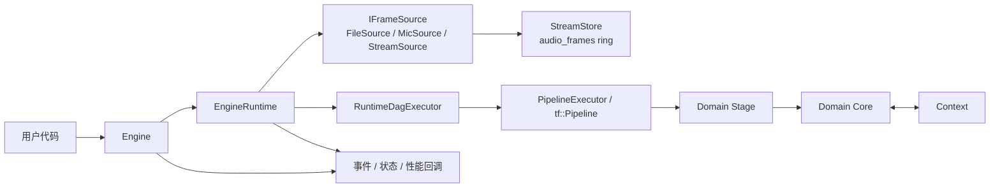
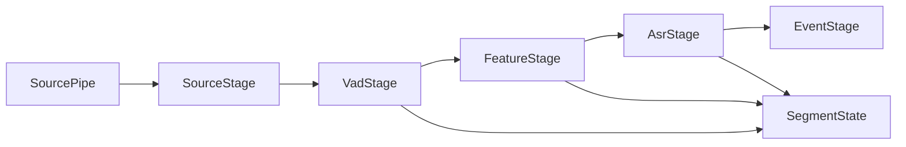
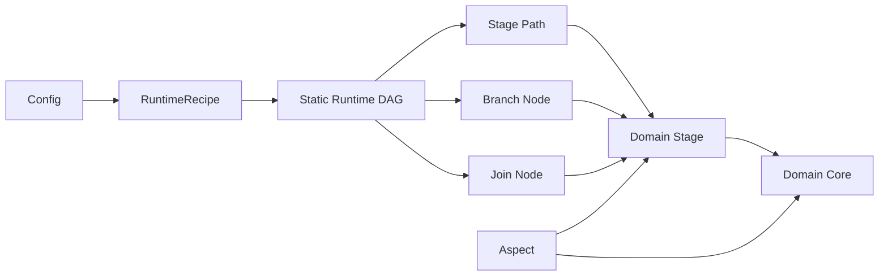
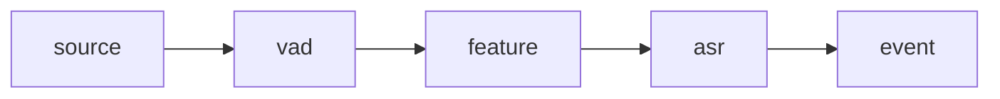
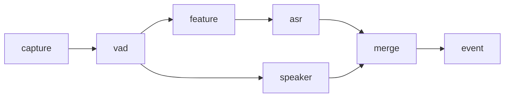

# 设计文档

本文档基于当前代码实现整理，重点回答三个问题：

- 系统是怎样跑起来的
- 核心组件各自负责什么
- 配置里哪些字段真的驱动了运行时，哪些只是被解析或保留

## 总览

当前流式运行时已经统一到 Taskflow 主线；静态 DAG 能力作为同一套设计下的扩展层存在，但不反客为主。



## 当前主线运行时

当前默认主线是 Taskflow 运行时路径，它使用真正的 `tf::Pipeline` 来承载线性流段。

其核心结构如下：



这条路径已经是当前流式运行时默认主线；线性配置会先被编译成单路径静态 DAG，再交给 `tf::Pipeline` 和 `RuntimeDagExecutor` 组合执行。

这里需要区分两层：

- `SourcePipe`
  - `tf::Pipeline` 的技术入口，负责 token 注入和背压
- `SourceStage`
  - 显式的运行时节点，负责把 source 也纳入 stage DAG 语义

## 静态 DAG 设计

新运行时的正式设计口径不是“整个系统只有一条线性 pipeline”，而是：

- 配置描述 stage DAG
- 启动期根据配置构建静态运行图
- 运行期 DAG 结构不再变化
- 线性子路径优先由 `tf::Pipeline` 承载
- branch / join 由 runtime DAG 层处理



### 当前推荐原则

1. 配置控制 DAG 结构，运行时结构固定不变。
2. `tf::Pipeline` 负责线性流段，而不是强行承载任意 DAG。
3. `Source` 也是显式 stage；顶层 `source` 只是简写，运行时会编译成 `SourceStage`。
4. 领域 `Stage` 负责 runtime 语义和 token/segment 流转。
5. `Core` 负责真实算法处理。
6. `EventStage` 负责事件分发，属于 runtime 骨架层，而不是算法领域层。
7. `Aspect` 继续保留，用于日志、计时、统计、告警、追踪等横切能力。

### 线性段与分支能力

当前推荐主线是单路径静态 DAG：



但设计上已经明确要扩展到可配置依赖关系，例如：



这类结构在新设计里会被解释为：

- `vad -> feature -> asr` 是一个线性段
- `vad -> speaker` 是一条分支
- `merge` 是汇聚点

## Recipe 与运行图

`PipelineRuntimeRecipe` 现在不仅表达角色识别，也开始表达 DAG 信息：

- `stage_id`
- `role`
- `depends_on`
- `downstream_ids`
- `node_kind`
- `join_policy`

其中 `node_kind` 约定为：

- `Linear`
- `Branch`
- `Join`
- `Isolated`

其中 `join_policy` 当前约定为：

- `all_of`
- `any_of`

语义如下：

- `all_of`
  `Join` 节点等待所有上游都为同一 token key 产出结果后，再向下游继续推进。
- `any_of`
  `Join` 节点在任一上游结果到达时即可向下游继续推进，后续同 key 结果默认不重复触发，`eos` 例外。

示例：

```json
{
  "id": "merge_stage",
  "depends_on": ["feature_stage", "vad_stage"],
  "join_policy": "all_of",
  "ops": [
    { "id": "merge", "name": "JoinBarrier" }
  ]
}
```

这使得运行时可以在不破坏配置驱动思路的前提下，把配置编译成静态 DAG，并把分支汇聚语义也纳入配置模型。

## 设计结论

1. `Engine` 是用户入口。
   它负责把 `EngineRuntime` 暴露成更稳定的 API，并把 ASR/VAD/状态/告警统一包装成 `EngineEvent`。

2. `EngineRuntime` 是真正的编排层。
   它负责读取运行时配置、创建底层输入 source、初始化对应的 runtime 执行器、启动 source thread 和 event thread，并维护性能统计。

3. 新主线里，线性 stage 路径由 `PipelineExecutor + tf::Pipeline` 承载。
   stage 的执行语义由 runtime recipe 和静态 DAG 决定，真实处理由领域 stage 下挂的 core 完成。

4. 数据面和控制面是分开的。
   当前主线以 `PipelineToken + SegmentState` 为主数据面。

5. 当前 Taskflow runtime 的主数据面是 `SegmentState`。
   `VAD -> Feature -> ASR` 路径已经围绕段级音频、段级特征和段级结果工作，`Context` 不再承担这条主路径的数据交换职责。

## 组件职责

### Engine

- 对外提供 `start()`、`finish()`、`stop()`
- 支持配置文件和 JSON 构造
- 支持 `audio_path`、`playback_rate`、`log_level`、`enable_event_queue` 覆盖
- 支持 callback 和 internal event queue 两种消费方式

### EngineRuntime

- 解析 `mode`、`task`、`source`、`frame`、`stream`
- 初始化默认 `MicSource("stream")`
- `source.type=file` 时改用 `FileSource + AudioFramePipelineSource`
- 维护 `input_eof`、`stream_drained`、RTF、首包时延、stop 开销等统计

### Runtime / Stage

- `PipelineExecutor` 负责线性 stage 路径，并把执行交给 `tf::Pipeline`
- `RuntimeDagExecutor` 负责静态 DAG 的 `Branch/Join` 路由
- `SourceStage` 负责把入口 source 纳入显式 stage DAG
- 领域 `Stage` 是运行时边界，`Core` 负责真实处理
- `EventStage` 负责把运行时结果统一转换成 `EngineEvent`
- `parallel` 字段目前不直接驱动调度，实际并发主要来自 `pipeline_lines`、`max_concurrency` 和 core 自身实现

### 当前代码组织

当前目录已经按“runtime”与“domain”两层拆开：

- runtime
  - `PipelineExecutor`
  - `RuntimeDagExecutor`
  - `EventStage`
- domain
  - `domain/source/`
    - `SourceStage`
    - `PassThroughSourceCore`
    - `FileSource`
    - `MicrophoneSource`
    - `StreamSource`
  - `domain/vad/`
    - `VadStage`
    - `SileroVadCore`
  - `domain/feature/`
    - `FeatureStage`
    - `KaldiFbankCore`
  - `domain/asr/`
    - `AsrStage`
    - `ParaformerCore`
    - `SenseVoiceCore`
    - `WhisperCore`

这样组织的原因是：

- `Vad / Feature / Asr` 的扩展需求是按领域一起演化的
- 领域 stage 和对应 core 强绑定，放在一起更容易维护
- `runtime/` 下放真正的运行时骨架，`domain/` 下放领域 stage/core

### StreamStore / FrameRing

- 默认音频 ring key 是 `audio_frames`
- 支持多 reader
- 支持 overrun 检测和 reader 恢复
- 保留 `eos` / `gap` 语义

### Context

- 保存处理链中的中间结果和事件
- 保存错误、状态统计、性能统计
- 运行时约定的核心键包括：
  - `asr_events`
  - `vad_segments`
  - `vad_is_speech`
  - `global_eof`
  - `audio_frame_*`

## 配置模型

配置可以分成两层理解。

## 横切扩展边界

当前主线同时保留 `Aspect` 和 `Capability`，但它们不是一回事。

- `Aspect`
  - 框架级 AOP
  - 用来统一包住 `Stage -> Core` 调用边界
  - 适合计时、tracing、统一日志、性能统计
- `Capability`
  - 配置驱动的节点扩展
  - 在 stage 初始化时安装，运行时按 `Pre/Post` 执行
  - 适合按配置启停的状态上报、审计标签、告警等行为

设计约束：

- 框架统一关注点优先放 `Aspect`
- 配置驱动的节点扩展优先放 `Capability`
- 不为同一件事同时维护一套 `Aspect` 和一套 `Capability`
- 默认性能统计口径由 `Aspect` 定义，当前主来源是 `TimerAspect`
- 治理型 capability 可以消费已有统计，但不替代默认性能统计链

### 一层：运行时生效字段

这些字段会被 `EngineRuntime` 直接消费：

| 字段 | 作用 |
|------|------|
| `mode` | `offline` 时文件输入会强制取消实时节流 |
| `task` | 写入 `EngineEvent.task`，默认 `asr` |
| `log_level` | 设置运行时日志级别 |
| `source.type` | `file`、`microphone`、`stream` |
| `source.path` | 文件输入路径 |
| `source.playback_rate` | 文件播放倍率；`0.0` 表示不按实时节流 |
| `frame.sample_rate/channels/dur_ms` | `AudioFrame` 基本参数 |
| `stream.ring_capacity_frames` | `audio_frames` ring 容量 |

### 二层：Pipeline 构图字段

这些字段会被 `PipelineConfig` / `PipelineRuntimeRecipe` 消费：

| 字段 | 作用 |
|------|------|
| `global.properties` | `${var}` 变量替换 |
| `global.capabilities` | 给每个处理节点注入全局 capability，并在 stage/core 边界执行 |
| `pipelines[].id` | stage 标识 |
| `pipelines[].max_concurrency` | stage executor 线程数 |
| `pipelines[].ops[]` | stage 内处理节点列表 |
| `ops[].id/name/params/capabilities/depends_on/error_handling` | 处理节点构图与初始化 |

### 三层：Runtime DAG 字段

这些字段是新设计需要长期保留的运行时图语义：

| 字段 | 作用 |
|------|------|
| `pipelines[].id` | stage 节点 ID |
| `pipelines[].depends_on` | stage 级依赖关系，描述 DAG 边 |
| `runtime.pipeline_lines` | 线性段并发 line 数 |
| `runtime.pipeline_name` | 运行图名称 |

当前 `depends_on`、`join_policy` 和 `join_timeout_ms` 已经进入 `PipelineRuntimeRecipe`，`RuntimeDagExecutor` 负责静态 DAG 上的 `Branch/Join` 路由与轻量汇聚语义。

### 当前仅解析或保留、未形成稳定行为的字段

下面这些字段在代码里存在，但当前不应当被文档写成“稳定可依赖功能”：

| 字段 | 当前状态 |
|------|------|
| `pipeline.push_chunk_samples` | 配置存在，当前运行时未直接消费 |
| 顶层 `output` | 配置存在，当前 `Engine`/示例程序并未据此自动输出文件或 JSON |
| `pipelines[].input.key` / `pipelines[].output.key` | 会被解析，但当前调度主路径没有据此做 stage 间数据路由 |
| `ops[].parallel` | 仅作为配置标记保留 |

## 已注册 Core

当前代码中可确认已注册的 core 名称只有这些：

- `SileroVad`
- `KaldiFbank`
- `AsrParaformer`
- `AsrSenseVoice`
- `AsrWhisper`

## Source 语义

| `source.type` | 实际行为 |
|------|------|
| `file` | 使用 `FileSource`，再封装成 `AudioFramePipelineSource` |
| `microphone` | 使用 `MicSource` |
| `stream` | 使用独立的 `StreamSource`，适合外部手动推帧 |

## 推荐阅读顺序

1. [架构设计](/Users/eagle/workspace/Playground/Yspeech/doc/architecture.md)
2. [核心组件](/Users/eagle/workspace/Playground/Yspeech/doc/components.md)
3. [配置说明](/Users/eagle/workspace/Playground/Yspeech/doc/configuration.md)
4. [性能说明](/Users/eagle/workspace/Playground/Yspeech/doc/performance.md)
