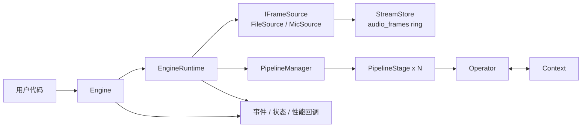
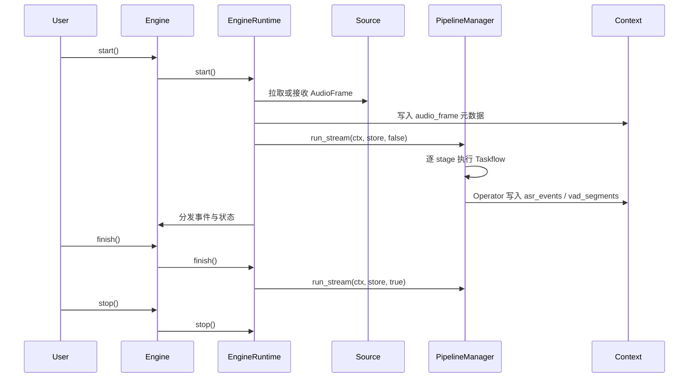

# 设计文档

本文档基于当前代码实现整理，重点回答三个问题：

- 系统是怎样跑起来的
- 核心组件各自负责什么
- 配置里哪些字段真的驱动了运行时，哪些只是被解析或保留

## 总览

## 运行时主链路

## 设计结论

1. `Engine` 是用户入口。
   它负责把 `EngineRuntime` 暴露成更稳定的 API，并把 ASR/VAD/状态/告警统一包装成 `EngineEvent`。

2. `EngineRuntime` 是真正的编排层。
   它负责读取运行时配置、创建 source、初始化 `StreamStore`/`PipelineManager`/`Context`、启动 source thread 和 event thread，并维护性能统计。

3. `PipelineManager` 只做流式调度。
   当前公开入口是 `run_stream(ctx, store, flush)`。

4. `PipelineStage` 内部用 `Taskflow` 固定图执行 operator。
   operator 的执行顺序由 `depends_on` 建图决定，stage 级线程数由 `max_concurrency` 控制。

5. 数据面和控制面是分开的。
   `AudioFrame` 通过 `StreamStore`/`FrameRing` 流动；中间结果、事件、错误和统计通过 `Context` 共享。

## 组件职责

### Engine

- 对外提供 `start()`、`finish()`、`stop()`
- 支持配置文件和 JSON 构造
- 支持 `audio_path`、`playback_rate`、`log_level`、`enable_event_queue` 覆盖
- 支持 callback 和 internal event queue 两种消费方式

### EngineRuntime

- 解析 `mode`、`task`、`source`、`frame`、`stream`
- 初始化默认 `MicSource("stream")`
- `source.type=file` 时改用 `FileSource + AudioFramePipelineSource`
- 维护 `input_eof`、`stream_drained`、RTF、首包时延、stop 开销等统计

### PipelineManager / PipelineStage

- `PipelineManager` 根据 `PipelineConfig` 创建多个 stage
- 单 stage 直接执行，多 stage 为每个 stage 起一个线程
- 每个 stage 内部再用 `Taskflow` 跑 operator DAG
- `parallel` 字段目前不直接驱动调度，实际并发主要来自 `max_concurrency` 和 operator 自身实现

### StreamStore / FrameRing

- 默认音频 ring key 是 `audio_frames`
- 支持多 reader
- 支持 overrun 检测和 reader 恢复
- 保留 `eos` / `gap` 语义

### Context

- 保存 operator 中间结果和事件
- 保存错误、状态统计、性能统计
- 运行时约定的核心键包括：
  - `asr_events`
  - `vad_segments`
  - `vad_is_speech`
  - `global_eof`
  - `audio_frame_*`

## 配置模型

配置可以分成两层理解。

### 一层：运行时生效字段

这些字段会被 `EngineRuntime` 直接消费：

| 字段 | 作用 |
|------|------|
| `mode` | `offline` 时文件输入会强制取消实时节流 |
| `task` | 写入 `EngineEvent.task`，默认 `asr` |
| `log_level` | 设置运行时日志级别 |
| `source.type` | `file`、`microphone`、`stream` |
| `source.path` | 文件输入路径 |
| `source.playback_rate` | 文件播放倍率；`0.0` 表示不按实时节流 |
| `frame.sample_rate/channels/dur_ms` | `AudioFrame` 基本参数 |
| `stream.ring_capacity_frames` | `audio_frames` ring 容量 |

### 二层：Pipeline 构图字段

这些字段会被 `PipelineConfig` / `PipelineManager` 消费：

| 字段 | 作用 |
|------|------|
| `global.properties` | `${var}` 变量替换 |
| `global.capabilities` | 给每个 operator 注入全局 capability |
| `pipelines[].id` | stage 标识 |
| `pipelines[].max_concurrency` | stage executor 线程数 |
| `pipelines[].ops[]` | operator 列表 |
| `ops[].id/name/params/depends_on/error_handling` | operator 构图与初始化 |

### 当前仅解析或保留、未形成稳定行为的字段

下面这些字段在代码里存在，但当前不应当被文档写成“稳定可依赖功能”：

| 字段 | 当前状态 |
|------|------|
| `pipeline.push_chunk_samples` | 配置存在，当前运行时未直接消费 |
| 顶层 `output` | 配置存在，当前 `Engine`/示例程序并未据此自动输出文件或 JSON |
| `pipelines[].input.key` / `pipelines[].output.key` | 会被解析，但当前调度主路径没有据此做 stage 间数据路由 |
| `ops[].parallel` | 仅作为配置标记保留 |

## 已注册 Operator

当前代码中可确认已注册的 operator 名称只有这些：

- `SileroVad`
- `KaldiFbank`
- `AsrParaformer`
- `AsrSenseVoice`
- `AsrWhisper`

## Source 语义

| `source.type` | 实际行为 |
|------|------|
| `file` | 使用 `FileSource`，再封装成 `AudioFramePipelineSource` |
| `microphone` | 回退到默认 `MicSource` |
| `stream` | 目前同样回退到默认 `MicSource`，还不是独立的 stream source 实现 |

## 推荐阅读顺序

1. [架构设计](/Users/eagle/workspace/Playground/Yspeech/doc/architecture.md)
2. [核心组件](/Users/eagle/workspace/Playground/Yspeech/doc/components.md)
3. [配置说明](/Users/eagle/workspace/Playground/Yspeech/doc/configuration.md)
4. [性能说明](/Users/eagle/workspace/Playground/Yspeech/doc/performance.md)
