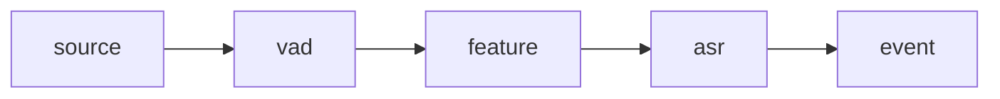

# 当前推荐开发基线

本文档只回答一个问题：`现在仓库里，团队默认应该以哪条路径作为开发和回归基线？`

## 默认主线

当前推荐把下面这条路径作为默认主线：

- 单线流式 ASR
- Taskflow runtime
- 配置驱动
- 启动期构图
- 运行期静态结构不变

对应配置：

- [streaming_paraformer_asr.json](/Users/eagle/workspace/Playground/Yspeech/examples/configs/streaming_paraformer_asr.json)

对应执行语义：



## 为什么默认选这条

原因很简单：

- 这是当前最稳定、最完整的一条新设计主线
- `streaming_demo` 默认就走这条配置
- 这条路径已经覆盖了真实 `Engine`、真实配置文件、真实音频 smoke
- 它最能代表“Taskflow 负责线性执行，我们自己只补最少语义”的设计原则

## 开发优先级

日常开发和回归时，优先顺序建议是：

1. 先保证单线流式 ASR 主线不回退
2. 再保证 branch/join 不破坏单线主线
3. 最后再看 join timeout 这类扩展语义

## 推荐示例配置

### 主线基线

- [streaming_paraformer_asr.json](/Users/eagle/workspace/Playground/Yspeech/examples/configs/streaming_paraformer_asr.json)

### DAG 能力验证

- [streaming_paraformer_asr_dag.json](/Users/eagle/workspace/Playground/Yspeech/examples/configs/streaming_paraformer_asr_dag.json)

### DAG timeout 验证

- [streaming_paraformer_asr_dag_timeout.json](/Users/eagle/workspace/Playground/Yspeech/examples/configs/streaming_paraformer_asr_dag_timeout.json)

## 推荐回归测试

### 单线主线

- `TestAsrRealAudio.StreamingEnginePipelineSmoke`
- `TestAsrRealAudio.StreamingEnginePipelineConfigFileSmoke`

### DAG 分支

- `TestAsrRealAudio.StreamingEngineBranchingPipelineSmoke`

### DAG 汇聚

- `TestAsrRealAudio.StreamingEngineJoiningPipelineSmoke`

### DAG 超时

- `TestAsrRealAudio.StreamingEngineJoinTimeoutPipelineSmoke`

## 推荐命令

### 跑默认主线 demo

```bash
./build/examples/streaming_demo \
  examples/configs/streaming_paraformer_asr.json \
  model/asr/sherpa-onnx-paraformer-zh-2023-09-14/test_wavs/0.wav \
  0.0
```

### 跑主线 smoke

```bash
./build/test/test --gtest_filter=TestAsrRealAudio.StreamingEnginePipelineSmoke:TestAsrRealAudio.StreamingEnginePipelineConfigFileSmoke
```

## 当前设计边界

为了避免设计继续发散，建议始终记住这几个边界：

- 线性段执行继续交给 `tf::Pipeline`
- `RuntimeDagExecutor` 只做静态 DAG 路由和轻量 join 语义
- 主数据面保持在 `PipelineToken + SegmentState + RuntimeContext`
- 不为了 DAG 再发明一套独立任务系统

## 一句话结论

当前团队默认开发基线应该是：

- `单线流式 ASR 主线`
- `示例配置文件可直接运行`
- `DAG 能力作为增量验证层存在，但不反客为主`
