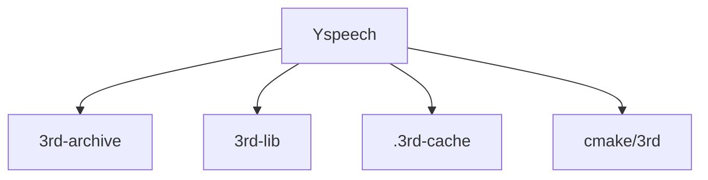
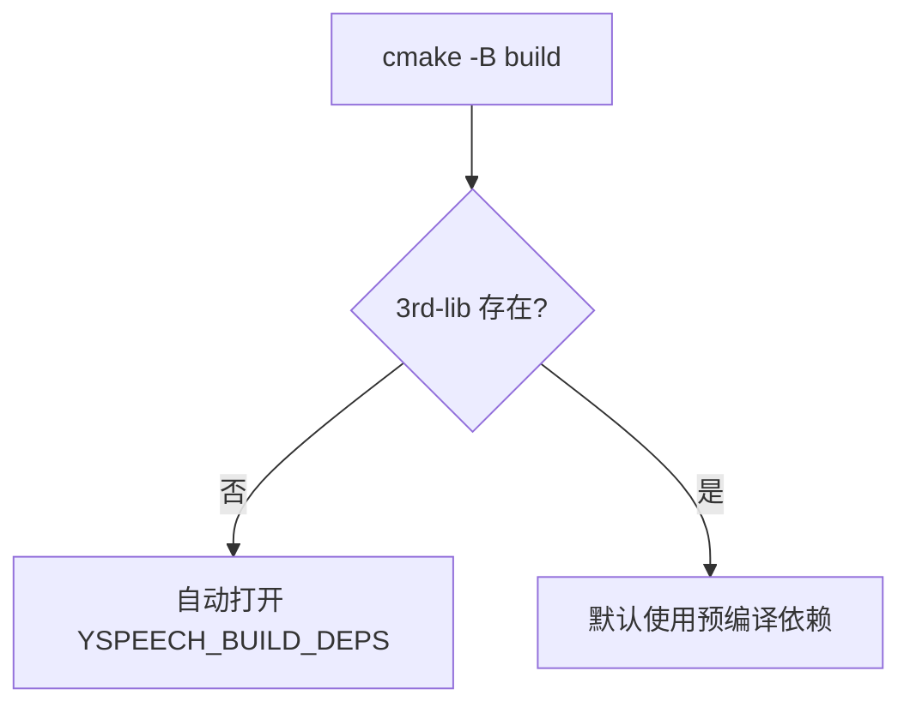

# 第三方库说明

本文档只描述当前仓库里真实在用的第三方依赖和构建方式。

## 当前依赖

| 库名 | 版本/来源 | 类型 | 用途 |
|------|------|------|------|
| nlohmann_json | 3.12.0 | Header-only | JSON 配置解析 |
| GoogleTest | 1.17.0 | 静态库 | 单元测试 |
| Taskflow | 4.0.0 | Header-only | stage/core 流水线调度 |
| spdlog | 1.17.0 | Header-only | 日志 |
| kaldi-native-fbank | 1.20.0 | 静态库 | fbank 特征提取 |
| ONNX Runtime | 1.24.3 | 预编译库 | 模型推理 |

## 目录结构



说明：

- `3rd-archive/` 放源码归档
- `3rd-lib/` 放预编译依赖
- `.3rd-cache/` 是 `FetchContent` 缓存
- `cmake/3rd/` 里是每个依赖的接入脚本

## 构建策略

根目录 [CMakeLists.txt](/Users/eagle/workspace/Playground/Yspeech/CMakeLists.txt) 的逻辑是：



### 常用命令

```bash
cmake -B build -G Ninja
cmake --build build
```

如果缺少预编译依赖，构建会走 `FetchContent` 或本地归档安装流程。

## 当前 CMake 接入点

项目实际包含这些脚本：

- `cmake/3rd/json.cmake`
- `cmake/3rd/gtest.cmake`
- `cmake/3rd/taskflow.cmake`
- `cmake/3rd/spdlog.cmake`
- `cmake/3rd/kaldi-native-fbank.cmake`
- `cmake/3rd/onnxruntime.cmake`

## 依赖使用现状

- 日志库已经是 `spdlog`，不是 `glog`
- `yspeech` 目标在 [src/CMakeLists.txt](/Users/eagle/workspace/Playground/Yspeech/src/CMakeLists.txt) 中链接：
  - `onnxruntime`
  - `taskflow`
  - `spdlog::spdlog`
  - `kaldi-native-fbank-core`
  - `nlohmann_json::nlohmann_json`

## 添加新依赖的建议流程

1. 把归档放进 `3rd-archive/`
2. 在 `cmake/3rd/` 新增对应 `xxx.cmake`
3. 在根目录 [CMakeLists.txt](/Users/eagle/workspace/Playground/Yspeech/CMakeLists.txt) 引入
4. 如果需要安装到 `3rd-lib/`，补充 `install_xxx` 目标

## 注意事项

- 文档和脚本都应以当前实际使用的依赖名为准
- 对 header-only 库，通常只需要 include 目录安装
- 对预编译库，优先保证 `INTERFACE_INCLUDE_DIRECTORIES` 和导入目标名称稳定
