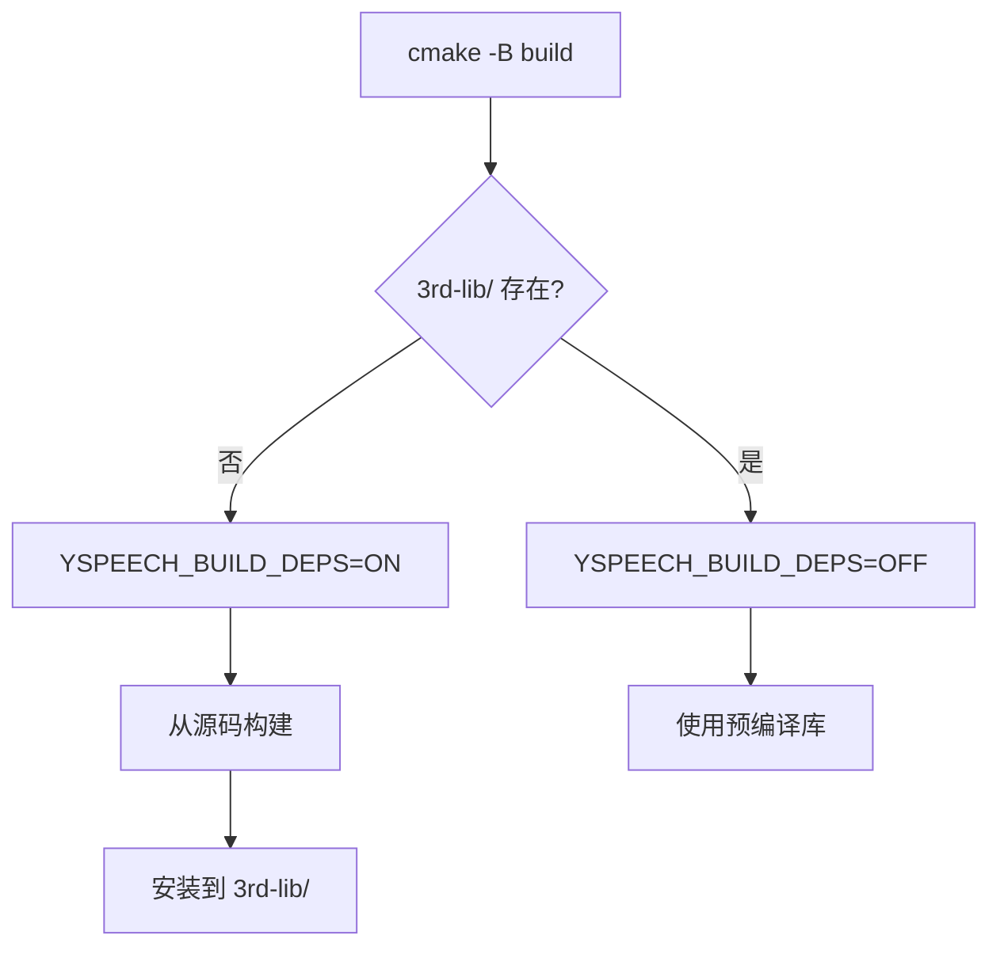

# 第三方库引入方法文档

## 概述

本文档描述 Yspeech 项目中第三方库的引入方法，包括目录结构、工作流程、模板文件和具体实现。

## 目录结构

```
Yspeech/
├── 3rd-archive/              # 源码归档目录
│   ├── json-3.12.0.tar.gz
│   ├── googletest-1.17.0.tar.gz
│   ├── taskflow-4.0.0.tar.gz
│   ├── glog-0.7.1.tar.gz
│   ├── kaldi-native-fbank-1.20.0.tar.gz
│   ├── onnxruntime-1.24.3.tar.gz
│   └── deps/                 # ONNX Runtime 依赖
│       ├── abseil-cpp-*.zip
│       ├── protobuf-*.zip
│       └── ...
│
├── 3rd-lib/                  # 预编译库目录（首次构建后生成）
│   ├── lib/
│   │   ├── libgtest.a
│   │   ├── libglog.a
│   │   ├── libonnxruntime_*.a
│   │   └── ...
│   └── include/
│       ├── nlohmann/
│       ├── gtest/
│       ├── taskflow/
│       ├── glog/
│       └── onnxruntime/
│
├── .3rd-cache/               # FetchContent 缓存目录
│   ├── nlohmann_json-src/
│   ├── nlohmann_json-build/
│   └── ...
│
└── cmake/
    └── 3rd/                  # 第三方库 CMake 配置
        ├── json.cmake
        ├── gtest.cmake
        ├── taskflow.cmake
        ├── glog.cmake
        ├── kaldi-native-fbank.cmake
        └── onnxruntime.cmake
```

## 工作流程

### 自动检测机制



### 构建命令

```bash
# 第一次构建（自动检测并构建第三方库）
cmake -B build -G Ninja
cmake --build build

# 后续构建（使用预编译库）
rm -rf build
cmake -B build -G Ninja
cmake --build build
```

## 第三方库 CMake 模板

### Header-only 库模板

适用于：nlohmann_json, taskflow 等

```cmake
# 1. 设置归档路径
set(XXX_ARCHIVE "${ARCHIVE_DIR}/xxx-version.tar.gz" CACHE FILEPATH "XXX archive path")

# 2. 检查归档是否存在（可选：自动下载）
if(NOT EXISTS "${XXX_ARCHIVE}")
  message(STATUS "Downloading XXX...")
  file(DOWNLOAD "https://..." "${XXX_ARCHIVE}" ...)
endif()

# 3. 检查预编译库是否存在
set(PREBUILT_XXX_DIR "${LIB_DIR}/include")
if(EXISTS "${PREBUILT_XXX_DIR}/xxx/xxx.hpp")
  add_library(xxx INTERFACE)
  target_include_directories(xxx INTERFACE "${PREBUILT_XXX_DIR}")
  message(STATUS "Using prebuilt XXX from ${PREBUILT_XXX_DIR}")
  return()
endif()

# 4. 从源码构建
message(STATUS "Building XXX from source...")

FetchContent_Declare(
  xxx
  URL "${XXX_ARCHIVE}"
  URL_HASH SHA256=...
  DOWNLOAD_EXTRACT_TIMESTAMP TRUE
  EXCLUDE_FROM_ALL
)

FetchContent_MakeAvailable(xxx)

# 5. 安装目标
if(YSPEECH_BUILD_DEPS)
  add_custom_target(install_xxx
    COMMAND ${CMAKE_COMMAND} -E make_directory "${LIB_DIR}/include"
    COMMAND ${CMAKE_COMMAND} -E copy_directory "${xxx_SOURCE_DIR}/include" "${LIB_DIR}/include/"
    COMMENT "Installing XXX to ${LIB_DIR}"
  )
  set_target_properties(install_xxx PROPERTIES FOLDER "CMake/Install")
  add_dependencies(yspeech_install_3rd_lib install_xxx)
endif()
```

### 静态库模板

适用于：gtest, glog, kaldi-native-fbank 等

```cmake
# 1. 设置归档路径
set(XXX_ARCHIVE "${ARCHIVE_DIR}/xxx-version.tar.gz" CACHE FILEPATH "XXX archive path")

# 2. 检查归档是否存在（可选：自动下载）
if(NOT EXISTS "${XXX_ARCHIVE}")
  message(STATUS "Downloading XXX...")
  file(DOWNLOAD "https://..." "${XXX_ARCHIVE}" ...)
endif()

# 3. 检查预编译库是否存在
set(PREBUILT_XXX_LIB "${LIB_DIR}/lib/libxxx.a")
if(EXISTS "${PREBUILT_XXX_LIB}")
  add_library(xxx STATIC IMPORTED)
  set_target_properties(xxx PROPERTIES
    IMPORTED_LOCATION "${PREBUILT_XXX_LIB}"
    INTERFACE_INCLUDE_DIRECTORIES "${LIB_DIR}/include"
  )
  message(STATUS "Using prebuilt XXX from ${LIB_DIR}")
  return()
endif()

# 4. 从源码构建
message(STATUS "Building XXX from source...")

# 设置构建选项
set(BUILD_SHARED_LIBS OFF CACHE BOOL "" FORCE)

FetchContent_Declare(
  xxx
  URL "${XXX_ARCHIVE}"
  URL_HASH SHA256=...
  DOWNLOAD_EXTRACT_TIMESTAMP TRUE
  EXCLUDE_FROM_ALL
)

FetchContent_MakeAvailable(xxx)

# 5. 安装目标
if(YSPEECH_BUILD_DEPS)
  add_custom_target(install_xxx
    COMMAND ${CMAKE_COMMAND} -E make_directory "${LIB_DIR}/lib"
    COMMAND ${CMAKE_COMMAND} -E make_directory "${LIB_DIR}/include"
    COMMAND ${CMAKE_COMMAND} -E copy_if_different "$<TARGET_FILE:xxx>" "${LIB_DIR}/lib/"
    COMMAND ${CMAKE_COMMAND} -E copy_directory "${xxx_SOURCE_DIR}/include" "${LIB_DIR}/include/"
    COMMENT "Installing XXX to ${LIB_DIR}"
  )
  set_target_properties(install_xxx PROPERTIES FOLDER "CMake/Install")
  add_dependencies(yspeech_install_3rd_lib install_xxx)
  add_dependencies(install_xxx xxx)
endif()
```

### 复杂依赖库模板

适用于：ONNX Runtime 等有大量依赖的库

```cmake
# 1. 设置归档路径
set(XXX_ARCHIVE "${ARCHIVE_DIR}/xxx-version.tar.gz" CACHE FILEPATH "XXX archive path")

# 2. 检查预编译库是否存在
set(PREBUILT_XXX_LIB "${LIB_DIR}/lib/libxxx.a")
if(EXISTS "${PREBUILT_XXX_LIB}")
  add_library(xxx STATIC IMPORTED)
  set_target_properties(xxx PROPERTIES
    IMPORTED_LOCATION "${PREBUILT_XXX_LIB}"
    INTERFACE_INCLUDE_DIRECTORIES "${LIB_DIR}/include"
  )
  # 链接依赖库
  file(GLOB XXX_DEP_LIBS "${LIB_DIR}/lib/*.a")
  list(REMOVE_ITEM XXX_DEP_LIBS "${PREBUILT_XXX_LIB}")
  if(XXX_DEP_LIBS)
    set_target_properties(xxx PROPERTIES
      INTERFACE_LINK_LIBRARIES "${XXX_DEP_LIBS}"
    )
  endif()
  message(STATUS "Using prebuilt XXX from ${LIB_DIR}")
  return()
endif()

# 3. 定义依赖列表并自动下载
set(DEPS_DIR "${ARCHIVE_DIR}/deps")
set(XXX_DEPS
  "dep1-version.zip;https://github.com/.../dep1.zip"
  "dep2-version.zip;https://github.com/.../dep2.zip"
)

file(MAKE_DIRECTORY "${DEPS_DIR}")

foreach(DEP_SPEC ${XXX_DEPS})
  list(GET DEP_SPEC 0 DEP_FILE)
  list(GET DEP_SPEC 1 DEP_URL)
  set(DEP_PATH "${DEPS_DIR}/${DEP_FILE}")
  if(NOT EXISTS "${DEP_PATH}")
    message(STATUS "Downloading ${DEP_FILE}...")
    file(DOWNLOAD "${DEP_URL}" "${DEP_PATH}" ...)
  endif()
endforeach()

# 4. 从源码构建（使用 FetchContent_Populate 进行自定义操作）
FetchContent_Declare(xxx URL "${XXX_ARCHIVE}" ...)
FetchContent_Populate(xxx)

# 设置依赖 URL 指向本地归档
set(DEP_URL_dep1 "file://${DEPS_DIR}/dep1-version.zip")
# ...

add_subdirectory(${xxx_SOURCE_DIR} ${xxx_BINARY_DIR} EXCLUDE_FROM_ALL)

# 5. 安装目标
if(YSPEECH_BUILD_DEPS)
  add_custom_target(install_xxx ...)
  add_dependencies(yspeech_install_3rd_lib install_xxx)
endif()
```

## 现有第三方库列表

| 库名 | 版本 | 类型 | 用途 |
|------|------|------|------|
| nlohmann_json | 3.12.0 | Header-only | JSON 配置解析 |
| GoogleTest | 1.17.0 | 静态库 | 单元测试 |
| Taskflow | 4.0.0 | Header-only | 任务并行 |
| glog | 0.7.1 | 静态库 | 日志 |
| kaldi-native-fbank | 1.20.0 | 静态库 | 音频特征提取 |
| ONNX Runtime | 1.24.3 | 静态库 + 依赖 | ML 推理 |

## 添加新第三方库步骤

1. **下载归档**：将源码包放到 `3rd-archive/` 目录

2. **创建 CMake 文件**：在 `cmake/3rd/` 目录创建 `xxx.cmake`

3. **引入到主 CMakeLists.txt**：
   ```cmake
   include(${CMAKE_SOURCE_DIR}/cmake/3rd/xxx.cmake)
   ```

4. **使用库**：
   ```cmake
   target_link_libraries(your_target PRIVATE xxx)
   ```

## 常见问题

### Q: 如何强制重新构建第三方库？

```bash
rm -rf 3rd-lib build
cmake -B build -G Ninja
cmake --build build
```

### Q: 如何只重新构建某个库？

```bash
rm 3rd-lib/lib/libxxx.a
rm -rf build
cmake -B build -G Ninja
cmake --build build
```

### Q: 如何清理 FetchContent 缓存？

```bash
rm -rf .3rd-cache
```

### Q: ONNX Runtime 构建时间太长怎么办？

ONNX Runtime 首次构建约需 5-10 分钟，建议：
1. 确保预编译库已正确安装
2. 后续构建会自动跳过，配置时间约 0.4 秒
